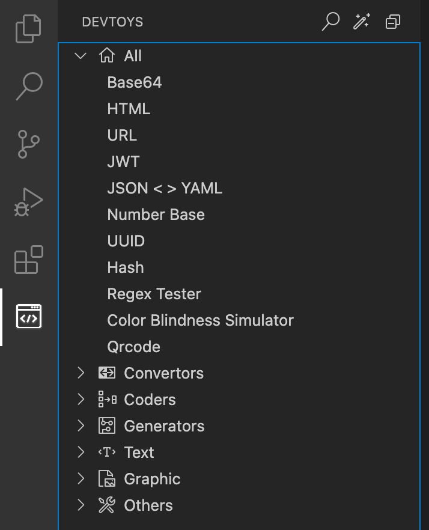

<p align="center">
  
</p>
<h1 align="center">
  DevToys for VSCode
</h1>
<p align="center">
  A Swiss Army knife for developers.This is the vscode extension version of <a href='https://github.com/veler/DevToys'>Devtoys</a>!
</p>
<p align="center">
  <a href="https://marketplace.visualstudio.com/items?itemName=kejun.devtoys">
    
  </a>
  <a href="https://github.com/KeJunMao/vscode-devtoys/blob/master/LICENSE">
    
  </a>
</p>

## Demo

- Base64
- HTML
- URL
- JWT
- JSON < > YAML
- Number Base
- UUID
- Hash
- Regex Tester
- Color Blindness Simulator
- Qrcode
- and more!



## Features

### Search Tool


### Automatically

You can click this button to automatically run that you want tool!


## Development

To set up your environment to develop DevToys, run `yarn`.

> Unlimited quality, quantity required, welcome contribution, use **React** or **Svelte** or **Vue**

### Add New Tool

Example: add **JWT Encoder/Decoder** tool

1. `yarn new`

```
❯ yarn new
? Tool label JWT
? Tool panel title JWT Encoder/Decoder
? Tool category Encoder/Decoder
? Tool webview framework React
✔  ++ /webview/pages/Jwt.tsx
✔  ++ /webview/components/Jwt/index.tsx
✔  ++ /src/Panel/Jwt.ts
✔  ++ /webview/components/Jwt/locales/en.json
✔  ++ /webview/components/Jwt/locales/zh-CN.json
✔  ++ /webview/components/Jwt/i18n.ts
✨  Done in 15.52s.
```

2. Add `PanelType` in `src/shared.ts`

```ts
enum PanelType {
  ...,
  jwt = "jwt"
}
```

3. Add tree item in `src/explorer/explorerNodeManager.ts`, JWT tool is a Coders category, so edit

```ts
 const coders: IToolData[] = [
  ...,
  {
    label: i18n.t("view.devtoys.coders.jwt.label"),
    tooltip: i18n.t("view.devtoys.coders.jwt.tooltip"),
    panel: PanelType.jwt,
  }
]
```

4. Show tool in `src/commands/showTool.ts`

```ts
switch (node.type) {
  ...
  case PanelType.jwt:
    jwt.createOrShow(context.extensionUri);
    break;
}
```

5. Make JWT tool and i18N key, then test the tool!

> NOTE: webview i18n file in `webview/components/TOOLNAME/locales`, extension i18n file in `locales`
